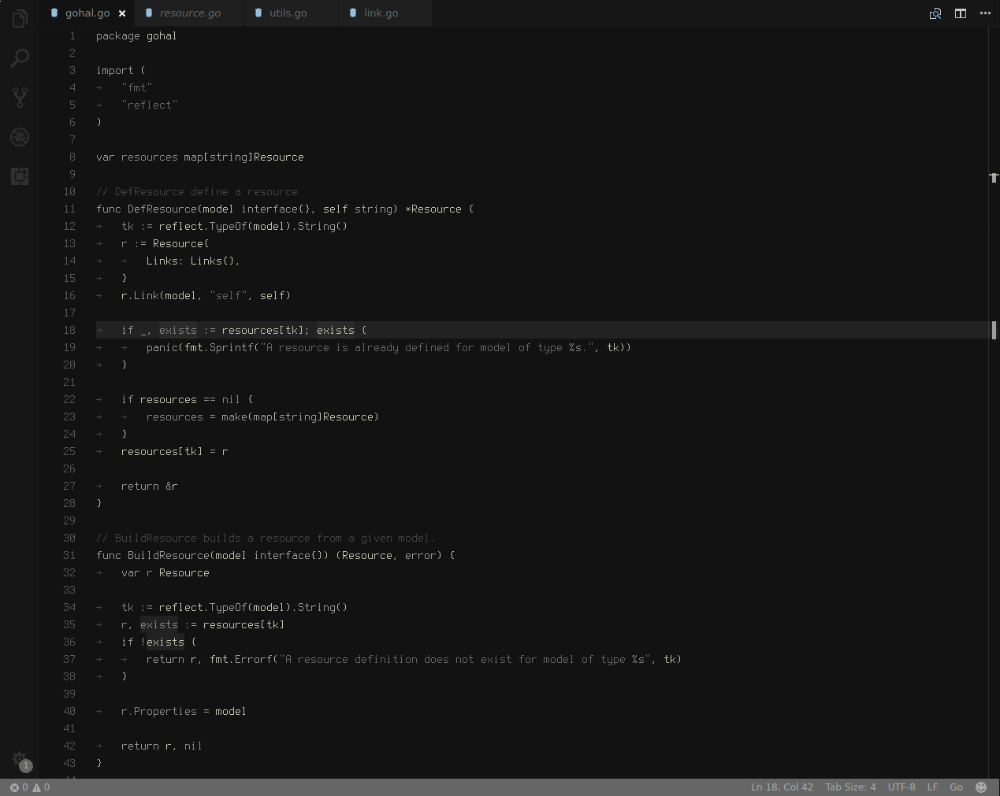
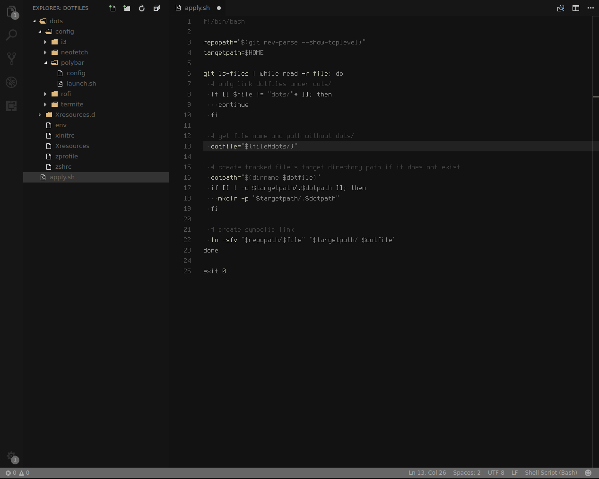
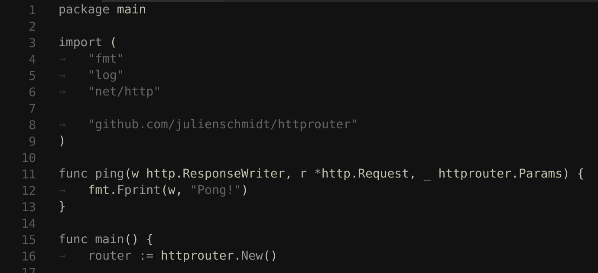
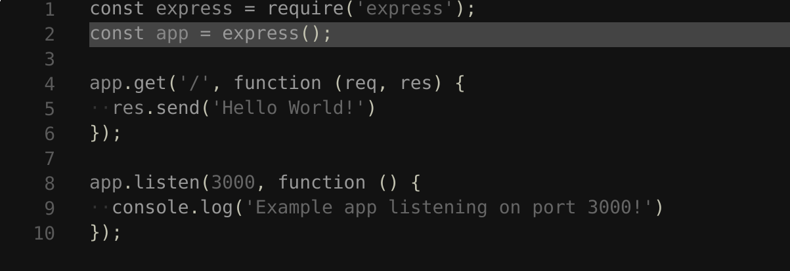

# No Happiness in Colors Theme

### A minimal, dark syntax theme for Visual Studio Code that does not make your code look like a parrot.

Fighting the good fight in making VS Code _darker_.

## Screenshots
### FYI
| Item | Name | Info | Link |
|------|------|------|------|
| Font  | Terminus | TTF version...yeah it works with Code | [Get it](https://files.ax86.net/terminus-ttf/). For my Arch Linux homies, it is also available in the [Arch User Repository](https://aur.archlinux.org/packages/terminus-font-ttf/). |
| Icons | Nomo Dark Icons | In my opinion, this icon set looks best with this theme, but to each their own. | [Get it](https://marketplace.visualstudio.com/items?itemName=be5invis.vscode-icontheme-nomo-dark) |

### Editor

### Explorer

### Below are pre-release screenshots but not much has changed in coloring language scopes.

### Go Syntax sample

### Javascript Syntax sample

